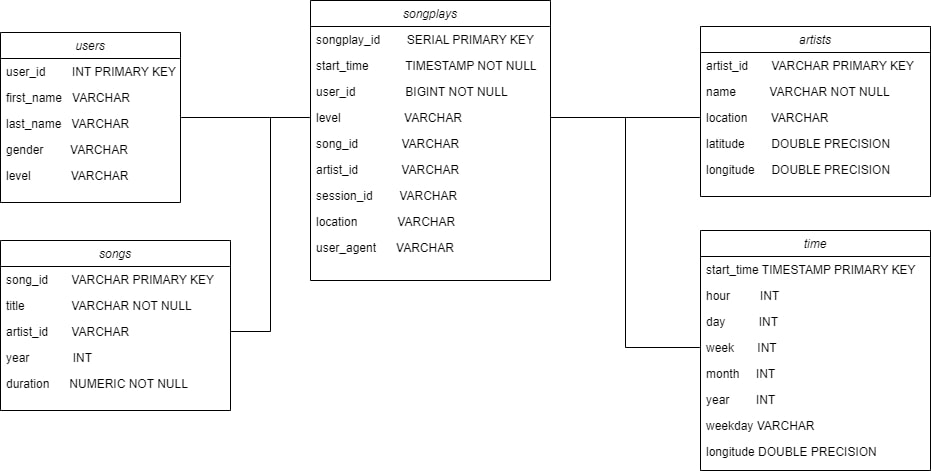

    # Project: Data Modeling with Postgres

## Introduction
- ### Problem
A startup called Sparkify wants to analyze the data it collects about songs and user activity with its new music streaming app. The analytics team is particularly interested in understanding the songs that users are listening to. Currently, there is no easy way to query the user activity of your app in the JSON log directory and the data in the directory that contains the JSON metadata for the songs in your app.

- ### Proposed Solution
The solution provided is to create a Postgres database with tables designed to support song playback analysis queries.

## How to run the python scripts
- Open Kernel
- Type "python Create_tables.py"
- Type "python etl.py"

## The files in repository
- Data: Contains 2 Type of files
 - Dataset: Contains the meta data of the song
 - Log: Simulates the log data saved by a music streaming app
- create_table.py: Python Script to connect to server and create database and tables using queries in sql_queries.py
- sql_queries.py: Contains string queries for creating, dropping, inserting into tables. also a select query.
- etl.py: Extracts data from datafile, do ETL process on data, insert data into tables.
- etl.ipynb: Develop ETL code
- test.ipynb: Test ETL code

## ETL Pipeline
### etl.py
- `process_data`
Read data path then save all json file in the path to a list to feed the file to the function given (data or logs) file by file.

- `process_song_file`
Read the json file then process it to insert it to the song and artist tables using `song_table_insert` and `artist_table_insert` queries that are imported from sql_queries.py file

- `process_log_file`
Read the json file then process it to insert it to the time, users song plays tables using `time_table_insert`, `user_table_insert`, and `songplay_table_insert` imported from sql_queries.py file

- `main`
establishes connection to server and runs `process_data` function while providing it with function and data path fitting together.

### Create_tables.py
- `create_database`
Creates a new database using given queries from sql_queries.py file.
- `drop_tables`
drops tables in database
- `create_tables`
Createss table in the database
- `main`
Deletes current tables if exists and creates new ones using `drop_tables` and `create_table` function

### sql_queries.py
Contains string to create and drop tables. Insert values into tables. Also, it contains a select query.

## Data Model
The implemented model is the Star Schema model. It has been selected due to it supporting join queries and the data we are dealing with is not big data.

### Schema
- Fact table: songplays
- Dimention table:
 - users
 - songs
 - artists
 - time

